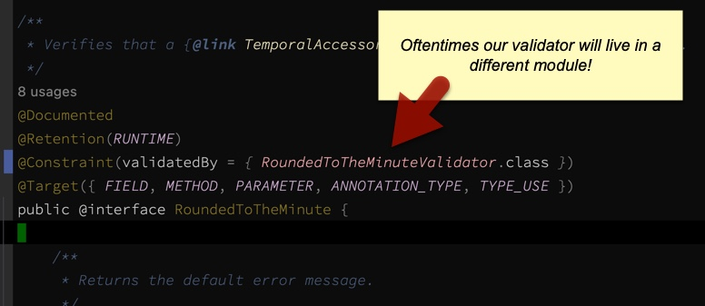

# validation-extras
Helper classes for working with Jakarta Bean Validation.

- [What is this?](#what-is-this-)
    * [Java validation in a nutshell](#java-validation-in-a-nutshell)
    * [What can be validated?](#what-can-be-validated-)
    * [`validation-extras` features](#-validation-extras--features)
- [Maven](#maven)
    * [For normal (non-Spring) projects](#for-normal--non-spring--projects)
    * [For Spring-based projects](#for-spring-based-projects)
- [How to use](#how-to-use)
    * [Normal (Non-Spring) usage](#normal--non-spring--usage)
    * [Usage From Spring](#usage-from-spring)
- [Validation cookbook](#validation-cookbook)
    * [What constraints does Jakarta Bean Validation offer?](#what-constraints-does-jakarta-bean-validation-offer-)
    * [How to assign a constraint validator programmatically](#how-to-assign-a-constraint-validator-programmatically)
    * [How to create a class-level constraint](#how-to-create-a-class-level-constraint)
    * [How to create a method-level constraint](#how-to-create-a-method-level-constraint)
- [Performance considerations](#performance-considerations)

# What is this?

The `validation-extras` library makes it easier to work with [Jakarta Bean Validation](https://hibernate.org/validator/),
most notably when you want to use it outside of the Spring framework.

## Java validation in a nutshell

Jakarta Bean Validation is a framework for validating fields and objects _declaratively_.
For example:

```java
// Example without Validation:
public void saveEmployee(Employee employee) {

    // Guard clauses:
    if (employee == null) {
        throw new IllegalArgumentException("Employee cannot be null.");
    }

    if (employee.getName() == null || employee.getName().isEmpty()) {
        throw new IllegalArgumentException("Employee name is missing.");
    }

    if (employee.getAge() < 1) {
        throw new IllegalArgumentException("Employee age must be greater than 0.");
    }

    LOG.info("Saving employee: {}", employee);
    // ...
}
```

It's cleaner to separate the validation logic from the business logic,
and the Jakarta Bean Validation framework allows us to do this:

```java
// Same example with Validation:
public void saveEmployee(Employee employee) {

    Validations.validate(employee);
    LOG.info("Saving employee: {}", employee);
    // ...
}
```

Where exactly did all those guard clauses go?
They became constraints inside the `Employee` class:

```java
public class Employee {
    @NotBlank
    private String name;
    
    @Min(1)
    private int age;
    // ...
}
```

Then when `Validations.validate(employee)` is called, those constraints are checked.

## What can be validated?

Things you can validate:
* Object fields or properties
* Method parameters
* Constructor parameters

Things you cannot validate:
* Static fields or parameters
    * This is a limitation the Jakarta Bean Validation API

## `validation-extras` features

Everything in this library starts with the `Validations` class.
That keeps it easy to remember.

```
Validations.check(obj)                      — validates an object and returns violations
Validations.validate(obj)                   — validates an object and throws if there are violations
Validations.createMethodValidator(...)      — creates a validator for a method (more info below)
Validations.createConstructorValidator(...) — creates validator for a class constructor
Validations.violation(...)                  — used in custom constraints: helps creates violation messages
``````

### Extra annotations

Check out the [reference docs](https://docs.jboss.org/hibernate/stable/validator/reference/en-US/html_single/#validator-defineconstraints-spec)
for the list of built-in annotations, or see my summary in the cookbook below.
This is a list of extra annotations that this library adds:

```
@PathExists    — checks if a Path or File exists
@PathNotExists — checks if a Path or File does not already exist
@IsDirectory   — checks that a Path or File exists and is a directory
@IsRegularFile — checks that a Path or File exists and is a file
```

Those are the basics. More details and examples are down below.

# Maven

This project provides two dependencies, one for Spring projects,
and one for "normal" non-Spring projects.
You only need to add one of them to your project.

## For normal (non-Spring) projects

Uses the latest [3.0.x](https://docs.jboss.org/hibernate/stable/validator/reference/en-US/html_single/)
Bean Validation API.
```xml
<dependency>
    <groupId>com.terheyden</groupId>
    <artifactId>validation-extras</artifactId>
    <version>0.0.1</version>
</dependency>
``````

## For Spring-based projects

Spring's validation support (as of 2022) still uses the [2.0.x](https://docs.jboss.org/hibernate/validator/6.2/reference/en-US/html_single/)
version of the Bean Validation API.
This version of `validation-extras` is compiled with those older Spring-compatible libraries.
```xml
<dependency>
    <groupId>com.terheyden</groupId>
    <artifactId>javax-validation-extras</artifactId>
    <version>0.0.1</version>
</dependency>
```

# How to use

Spring and non-Spring usage is very different, because Spring provides a lot of validation support.

## Normal (Non-Spring) usage

### Validating fields or properties

1. Annotate your fields or getter properties (either is fine):

```java
public class Employee {

    private final UUID userId;

    @NotBlank
    private final String name;

    @Min(1)
    private final int age;

    // ...
}
```

2. Call `Validations.validate(obj)`:

```java
private void doSomeWork(Employee employee){
    Validations.validate(employee);
    // ...
}
```

### Validating method parameters

1. Create a static `MethodValidator` for each method that uses validating
2. Call `XXX.validate(this, param1, param2, ...)` at the beginning of each method:

```java
class MyClass {

    // Validator for the greet() method and its parameters.
    private static final MethodValidator GREET = Validations
        .createMethodValidator(MyClass.class, "greet");

    // ...

    private String greet(@NotBlank String greeting, @Valid @NotNull Employee employee) {

        GREET.validate(this, greeting, employee);
        return "%s, %s!".formatted(greeting, employee.getName());
    }
}
```

### Validating constructor parameters

TODO: Validations.findConstructorValidator(clazz)

## Usage From Spring

If you're using Spring Boot, you'll need to add validation support:

```xml
<!-- Add Jakarta Bean Validation -->
<dependency>
    <groupId>org.springframework.boot</groupId>
    <artifactId>spring-boot-starter-validation</artifactId>
</dependency>
```

Spring takes care of validating objects and method parameters for any Spring-aware classes.
* DTO-like classes with data have validation annotations as usual
* Service-like classes that expect valid data have a `@Validated` annotation
* `@Valid` on a parameter tells the validator to _recurse_ into that object

For example:

```java
@Validated
@RestController
public class MyController {

    @GetMapping
    public String greet(@NotBlank String greeting, @Valid @NotNull Employee employee) {
        return "%s, %s!".formatted(greeting, employee.getName());
    }
}
```

# Validation cookbook

## What constraints does Jakarta Bean Validation offer?

Check out the full list in the [reference docs](https://docs.jboss.org/hibernate/stable/validator/reference/en-US/html_single/#validator-defineconstraints-spec).
Below is a concise summary:

```
@AssertTrue      — Boolean must be true, null ok
@AssertFalse     — Boolean must be false, null ok
@Email           — String must be a valid email (with optional regex), null ok
@Future          — DateTime must be in the future, null ok
@FutureOrPresent — DateTime must be now or future, null ok
@Length          — Strings only, between a min and max, null ok (docs don't mention null but I tested)
@Max             — nums only, null ok
@Min             — nums only, null ok
@NotBlank        — trimmed string is not null or empty
@NotEmpty        — String, array, Collection, or Map is not null or empty
@NotNull         — element is not null
@Negative        — number is negative, null ok
@NegativeOrZero  — number is negative or zero, null ok
@Null            — element is null
@Past            — date in the past, null ok
@PastOrPresent   — null ok
@Pattern         — does the String pass the given regex? Null ok
@Positive        — is the num positive, null ok
@PositiveOrZero  — is the num zero or positive, null ok
@Range           — is the num (or Stringed num) within range, null ok
@Size            — is the String, Collection, Map or Array of a certain size, null ok
@UniqueElements  — does the Collection contain no dupes, null ok
@URL             — String must be a valid URL, null ok

@Valid           — Params only, enables recursive validation, null ok!
@Validated       — Spring only, for classes, enables parameter validation
```

## How to assign a constraint validator programmatically

Oftentimes we want to annotate data classes in a library that is kept separate from the logic layer.
For example, we might have a 'lib' jar that we share with other services so they may see our data types,
a UI layer for our REST controllers, and service layer for our business logic.

In these instances, our validation constraints would live in the lib jar, but our validators
would most likely live in the service layer. It would be impossible to link the two together
(assuming the lib doesn't know about the service layer):



Here we'll discuss two ways to accomplish this separation by dynamically associating constraints with validators.
You can read more about this subject in the
[implementation docs](https://docs.jboss.org/hibernate/stable/validator/reference/en-US/html_single/#section-constraint-definition-contribution).

### For production code

1. Create your constraint but leave the validator _empty_
   1. So it would look like: `@Constraint(validatedBy = { })`
2. Create a validator for your constraint as usual
3. Create the constraint metadata file
   1. Normal projects: `src/main/resources/META-INF/services/jakarta.validation.ConstraintValidator`
   2. Spring projects: `src/main/resources/META-INF/services/javax.validation.ConstraintValidator`
4. Add an entry to the metadata file for each dynamic validator you create

_Example `src/main/resources/META-INF/services/jakarta.validation.ConstraintValidator` file:_
```
# Just add your dynamic validators in here.
# The association with the right annotation will happen automatically.
com.terheyden.validation.constraints.NotNullValidator
```

#### Easy copy-and-paste

Run the shell command below to create the metadata resource dir and touch the constraint metadata file:

```shell
# Normal project:
mkdir -pv src/main/resources/META-INF/services && touch src/main/resources/META-INF/services/jakarta.validation.ConstraintValidator
# Spring project:
mkdir -pv src/main/resources/META-INF/services && touch src/main/resources/META-INF/services/javax.validation.ConstraintValidator
```

Now, in your IDE, just search for the file and add to it.

### For testing

Unit tests sometimes don't pick up the `META-INF` relationships described above, so `validation-extras` provides another
way to set up the constraint-validator relationship.

```java
// We're going to create a custom link between a constraint annotation and a validator.
// To do this, we start with a ValidationsBuilder:
ValidationsBuilder builder = new ValidationsBuilder();
// Then we simply connect the two:
builder.addConstraintValidator(IsPresent.class, IsPresentValidator.class);

// If our validator is really straightforward,
// we can even just use a Lambda Function to define it:
builder.addConstraintValidator(
    Empty.class,                             // The constraint annotation
    List.class,                              // The type we expect to validate
    list -> list == null || list.isEmpty()); // The validation logic (true == is valid)

// Once we're done configuring, we can inject our changes
// into the global validator.
Validations.setValidator(builder);
```
(The code above comes from
[ValidationsBuilderTest.java](https://github.com/terheyden/validation-extras/blob/main/validation-extras/src/test/java/com/terheyden/valid/ValidationsBuilderTest.java)
in this repository in case you want to see the full example.)

## How to create a class-level constraint

You can create a class-level or method-level constraint for when you need to validate multiple
fields or parameters at the same time.

For class-level constraints, check out the [reference docs](https://docs.jboss.org/hibernate/stable/validator/reference/en-US/html_single/#section-class-level-constraints),
and check out the working example included here:
* [ValidEmployee.java](https://github.com/terheyden/validation-extras/blob/main/validation-extras/src/test/java/com/terheyden/valid/examples/ValidEmployee.java)
* [ValidEmployeeValidator.java](https://github.com/terheyden/validation-extras/blob/main/validation-extras/src/test/java/com/terheyden/valid/examples/ValidEmployeeValidator.java)
* [ValidEmployeeValidatorTest.java](https://github.com/terheyden/validation-extras/blob/main/validation-extras/src/test/java/com/terheyden/valid/examples/ValidEmployeeValidatorTest.java)

## How to create a method-level constraint

To create a method-level constraint, check out the [reference docs](https://docs.jboss.org/hibernate/stable/validator/reference/en-US/html_single/#section-cross-parameter-constraints),
and take a look at the working example in this repo:
* [OffsetLessThanStringLength.java](https://github.com/terheyden/validation-extras/blob/main/validation-extras/src/test/java/com/terheyden/valid/examples/OffsetLessThanStringLength.java)
* [OffsetLessThanStringLengthValidator.java](https://github.com/terheyden/validation-extras/blob/main/validation-extras/src/test/java/com/terheyden/valid/examples/OffsetLessThanStringLengthValidator.java)
* [OffsetLessThanStringLengthValidatorTest.java](https://github.com/terheyden/validation-extras/blob/main/validation-extras/src/test/java/com/terheyden/valid/examples/OffsetLessThanStringLengthValidatorTest.java)

## Working around method validators / self-validating objects

By using static factory methods, or builders, you can
create self-validating objects that don't need method / constructor validators.
Check out `ValidCat.java` and `ValidCatTest.java` in this repo for an example.

```java
/**
 * By using a static factory method (or a builder), we can be self-validating.
 */
public static MyObj newMyObj(String name, int age) {
    return Validations.validate(new MyObj(name, age));
}
```

# Performance considerations

Processing annotations might have you wondering about the performance impact of using
Jakarta Bean Validation or the validation-extras library.

In our JMH benchmarks, performing the validations and using this library
was extremely fast; significantly less expensive than a single `String.format()` call, and of course much,
much faster than a single `LOG.debug()` call.

Feel free to experiment with the benchmarks yourself; check out the `validation-benchmark`
module included in this repository.
